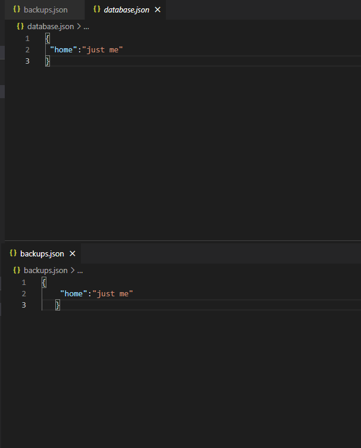

# plantio.db
It is an Easy-to-Use Database Module

Set
Records the Value You Specified in the Database to the Data You Specified
Login
```
const db = require ('plantio.db')
db.set("home","just me")
```
Output
```
"home":"just me"
```

Fetch
Allows You To Find The Data You Specified From The Database
Login
```
const db = require ('plantio.db')
const home = db.fetch("home")
console.log(home)
```
Output
```
"just me"
```
Delete
Deletes The Data You Specified From The Database
Login
```
const db = require ('plantio.db')
db.delete("home")
```
Output
```
true
```
Add
Allows You to Add Value to the Data You Specify
Login
```
const db = require ('plantio.db')
db.add("home",5000)
console.log(db.fetch("home"))
```
Output
```
5000
```
Subtract
Subtracts Value From Data You Specify
Login
```
const db = require ('plantio.db')
db.subtract("home",4999)
console.log(db.fetch("home"))
```
Output
```
1
```
Reset
Resets the database
Login
```
const db = require ('plantio.db')
db.reset()

```
Output
```
{}
```
Backup
Opens a New File with the File Name You Specified and Backs Up the Database There
Login
```
const db = require ('plantio.db')
db.backup("backups")

```
Output

 

Check
Checks if the Data You Specify in the Database Exists and Gives the Result as Boolean
Login
```
const db = require ('plantio.db')
db.check("home")

```
Output
```
true```
